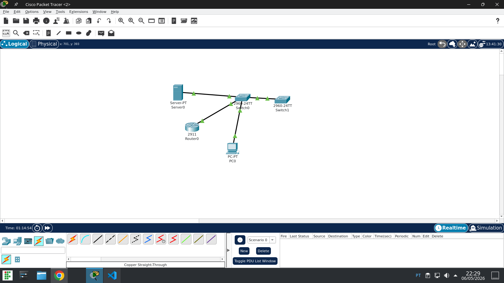

# Aula pratica SNMP

.1.3.6.1.2.1.1.1.0  (.iso.org.dod.internet.mgmt.mib-2.system.sysDescr.0)

Cisco IOS Software, C2900 Software (C2900-UNIVERSALK9-M), Version 15.1(4)M4, RELEASE SOFTWARE (fc2)
Technical Support: http://www.cisco.com/techsupport
Copyright (c) 1986-2012 by Cisco Systems, Inc.
Compiled Thurs 5-Jan-12 15:41 by pt_team

.1.3.6.1.2.1.1.3.0  (.iso.org.dod.internet.mgmt.mib-2.system.sysUpTime.0)

1 hours 18 minutes 40 seconds

## Reflexão

Em uma rede real, não é recomendado usar a community string public porque ela é muito conhecida e qualquer pessoa que saiba disso pode tentar acessar informações dos dispositivos da rede. Isso pode causar problemas de segurança, já que alguém poderia visualizar dados importantes do roteador ou do switch.

O SNMPv3 é mais seguro porque possui autenticação de usuário e criptografia, protegendo as informações que trafegam pela rede. Assim, somente pessoas autorizadas conseguem acessar ou alterar os dados dos equipamentos.

Por isso, em empresas e redes maiores, o SNMPv3 é mais utilizado para garantir maior segurança no monitoramento dos dispositivos.

# DESAFIO DA EXPANSÃO

 .1.3.6.1.2.1.1.1.0  (.iso.org.dod.internet.mgmt.mib-2.system.sysDescr.0)

Cisco IOS Software, C2960 Software (C2960-LANBASE-M), Version 12.2(25)FX, RELEASE SOFTWARE (fc1)
Copyright (c) 1986-2005 by Cisco Systems, Inc.
Compiled Wed 12-Oct-05 22:05 by pt_team

.1.3.6.1.2.1.1.3.0  (.iso.org.dod.internet.mgmt.mib-2.system.sysUpTime.0)

0 hours 32 minutes 26 seconds
